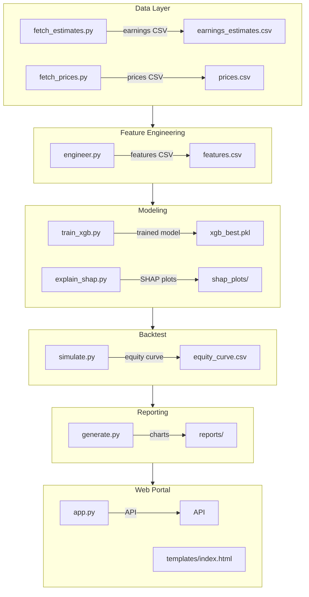

# Earnings Surprise Predictor


## Overview

The **Earnings Surprise Predictor** is a quantitative research pipeline that predicts whether a stock will beat or miss consensus earnings estimates. It downloads historical analyst EPS estimates and actual earnings, engineers ten predictive features, trains an XGBoost classifier with Optuna hyper‑parameter tuning, back‑tests a trading strategy, and provides a sleek web portal for interactive exploration.

## Architecture



## Quickstart

```bash
# Install dependencies (Python 3.10+)
python -m pip install -r requirements.txt

# Generate features
python -m earnings_predictor.features.generate_features

# Train model (Optuna will run 50 trials)
python -m earnings_predictor.models.train_xgb

# Compute SHAP explanations
python -m earnings_predictor.models.explain_shap

# Run backtest
python -m earnings_predictor.backtest.simulate

# Start web portal
python -m earnings_predictor.web.app
```

Visit <http://localhost:5000> to explore the dashboard.

## Technical Highlights

- **Data Sources**: Free EPS data via `yfinance`; synthetic analyst estimates for revisions.
- **Feature Set**: 10 engineered features (surprise history, estimate revisions, price momentum, volatility ratio, sector encoding, market‑cap log).
- **Model**: XGBoost with class‑imbalance handling (`scale_pos_weight`). Optuna performs hyper‑parameter search (max_depth, learning_rate, n_estimators, subsample, colsample_bytree).
- **Backtest**: Event‑driven simulation (enter 5 days before earnings, exit next‑day open, max 10 concurrent positions, 10 bps round‑trip cost). Metrics include total return, Sharpe, max drawdown, win rate, information ratio.
- **Explainability**: SHAP summary and waterfall plots for global and local interpretation.
- **Web UI**: Flask backend with REST API, dark‑mode glassmorphism design, interactive Plotly charts, KPI cards, and live prediction.

## Screenshots

*Dashboard mockup (generated by the AI)*


## License

MIT License – feel free to fork, modify, and use for personal or research purposes.

---

*Built with ❤️ by the Antigravity AI assistant.*
