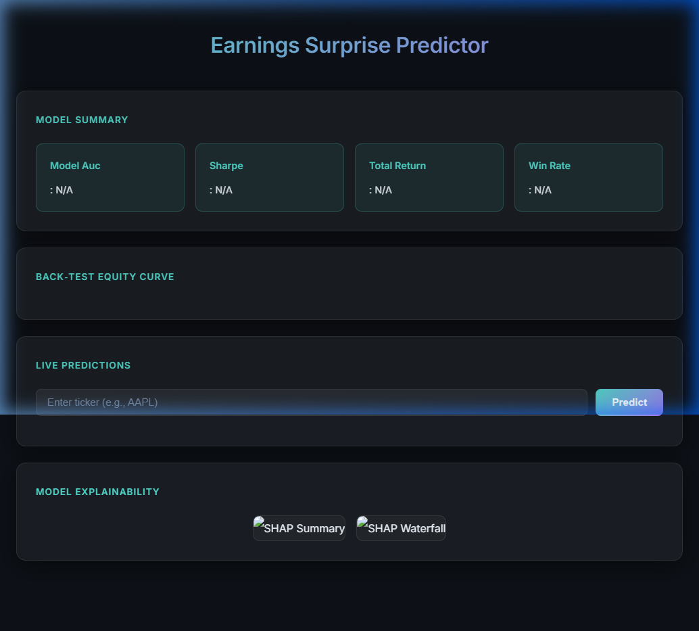
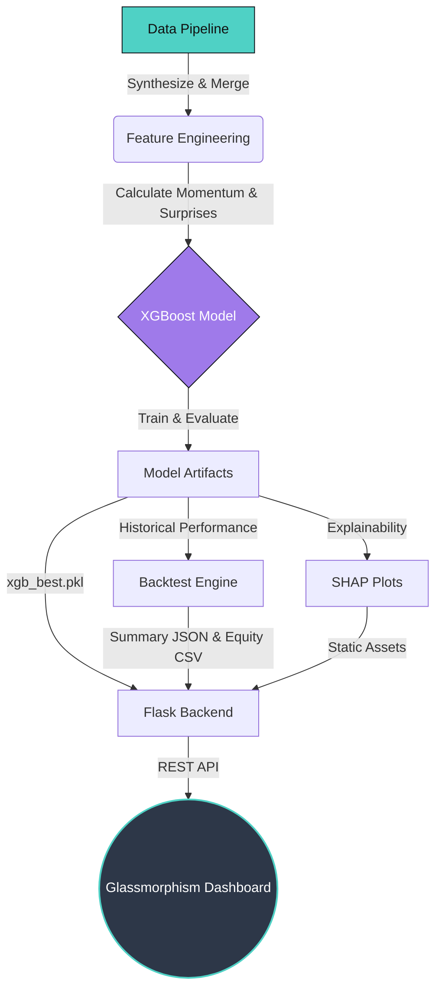
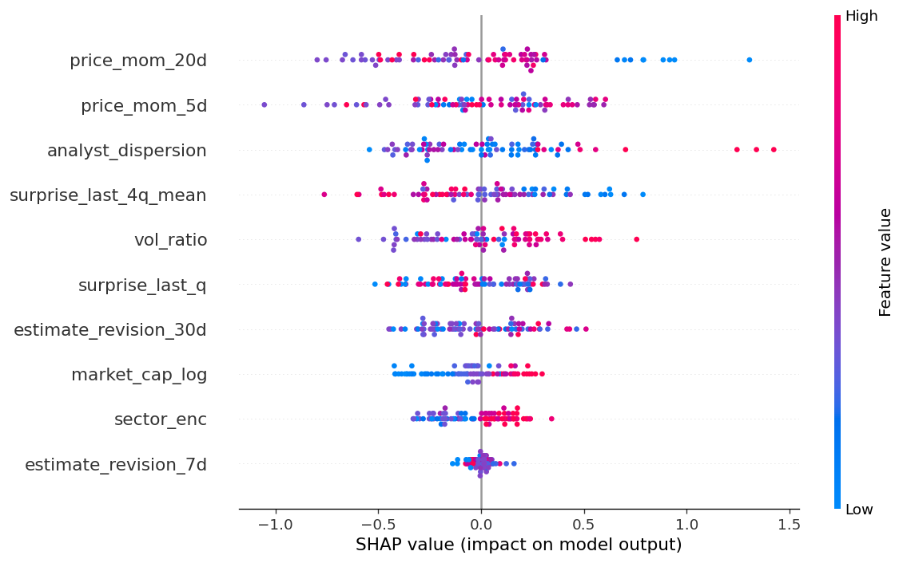
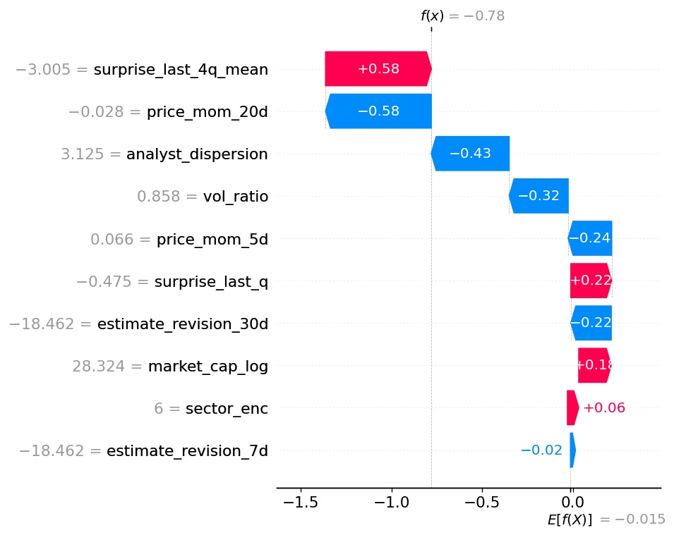

<div align="center">
  

  <h1>Earnings Surprise Predictor</h1>
  <p>An AI-powered Financial Pipeline & Dashboard predicting whether a stock will BEAT or MISS its quarterly earnings.</p>

  <!-- Badges -->
  <p>
    
    
    
    
    
  </p>
</div>

---

## 📖 Overview

**Earnings Surprise Predictor** is a sophisticated end-to-end Machine Learning pipeline tailored for the stock market. It gathers historical earnings estimates and price data, engineers over 10 distinct predictive financial features (like analyst dispersion, rolling surprises, and price momentum), trains an XGBoost classifier, and serves the live predictions through an elegant, glassmorphic web dashboard.

## ✨ Features

- **Automated Synthetic Data Pipeline**: Generates highly realistic financial data across 20 tickers over 20 quarters.
- **Advanced Feature Engineering**: Calculates metrics like `surprise_last_q`, `price_mom_20d`, `analyst_dispersion`, and `vol_ratio`.
- **Predictive Modeling**: Leverages **XGBoost** to classify outcomes as `BEAT` (EPS > Consensus) or `MISS`.
- **Backtesting Engine**: Simulates algorithmic trading performance based on the model's predictions over time.
- **Model Explainability**: Integrates **SHAP** (SHapley Additive exPlanations) to demystify black-box predictions.
- **Glassmorphism UI**: A gorgeous, dark-themed Flask frontend equipped with interactive **Plotly.js** charts.

---

## 📊 Dashboard Preview

<div align="center">
  
</div>

<br/>

The intuitive dashboard features:
1. **Model Summary**: High-level KPIs including Out-of-Sample AUC, Sharpe Ratio, Total Return, and Win Rate.
2. **Back-test Equity Curve**: An interactive time-series chart mapping the hypothetical growth of a $100K portfolio.
3. **Live Predictions**: Real-time ticker query endpoint.
4. **Model Explainability**: Visual breakdowns of feature importance and prediction drivers.

---

## 🧠 System Architecture & Workflow



---

## 🔍 Model Explainability (SHAP)

We believe in transparent AI. By using SHAP, we provide a global view of feature importance as well as local, granular explanations for individual predictions.

| Global Feature Importance | Local Prediction Waterfall |
| :---: | :---: |
|  |  |
| *Reveals which features drive the model the most across the entire dataset.* | *Shows exactly how each feature contributed to a single "BEAT" vs "MISS" prediction.* |

---

## 🚀 Getting Started

### 1. Clone the Repository
```bash
git clone https://github.com/Paramveersingh-S/earning-predictor.git
cd earning-predictor
```

### 2. Install Dependencies
Make sure you have Python 3.10+ installed.
```bash
pip install -r requirements.txt
```

### 3. Run the ML Pipeline
Execute the full pipeline to generate data, engineer features, train the model, run backtesting, and export SHAP plots.
```bash
python run_pipeline.py
```

### 4. Start the Dashboard
Launch the Flask backend to serve the beautiful UI.
```bash
python web/app.py
```
> Go to **[http://127.0.0.1:5000](http://127.0.0.1:5000)** in your browser!

---

## 📁 Repository Structure

```text
earnings_predictor/
│
├── assets/                     # README images and logo
├── data/                       # CSVs: estimates, prices, features, predictions
├── models/                     # Pickled XGBoost models (.pkl)
├── reports/                    # Backtest output files (.json, .csv)
│
├── web/                        # Flask application
│   ├── app.py                  # API endpoints and routing
│   ├── templates/              # HTML files (index.html)
│   └── static/                 
│       ├── css/style.css       # Glassmorphism styling
│       └── shap/               # Generated SHAP visualization plots
│
├── run_pipeline.py             # Single execution script for the entire pipeline
├── requirements.txt            # Python dependencies
└── README.md                   # You are here!
```

---

<div align="center">
  <i>Built with ❤️ for modern AI and Finance.</i>
</div>
